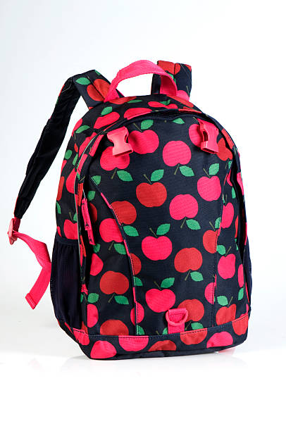
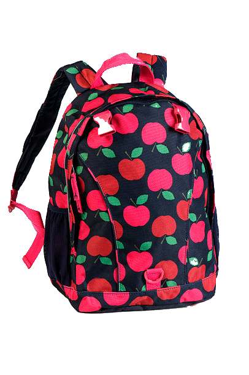
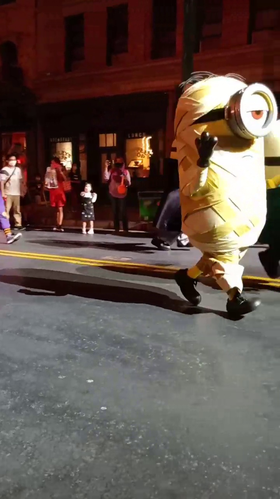
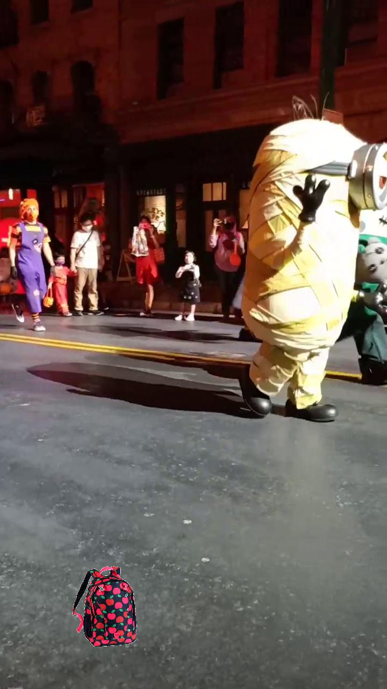

# "Cut and paste" augmentation

## Description
- This repo was with reference to RocketFlash's [CAP_augmentation](https://github.com/RocketFlash/CAP_augmentation)
  where easy to use Python implementation of "Cut and paste" augmentation for object detection and instance and semantic segmentations. The main idea was taken from [Simple Copy-Paste is a Strong Data Augmentation Method for Instance Segmentation](https://arxiv.org/pdf/2012.07177v1.pdf)
- This repo just added the capability of saving images and annotations in XML annotation (Pascal VOC format)

## Installation
Conda
```
conda create --name CAP_augmentation python=3.8 anaconda
conda activate CAP_augmentation
pip install -r requirements.txt
```

## Usage

### Loading data (default)
Default
- Place ONLY transparent PNG images that required cutting in [cut_images](cut_images) [Preferred]
OR
- Place ONLY jpg images that require transparent PNG images to be generated in [precut_images](precut_images) and indicate '--precut_images' flag

- Place images that require pasting in [paste_images](paste_images)
OR
- Place videos that require pasting in [paste_videos](paste_videos) and indicate '--videos' flag

### Code

```
python gen_xml_and_image_from_trans_folder.py
```

If  jpg images that require transparent PNG images to be generated in [precut_images](precut_images), execute this code

```
python gen_xml_and_image_from_trans_folder.py --precut_images
```

If video(s) that required pasting placed in [paste_videos](paste_videos), execute this code
```
python gen_xml_and_image_from_trans_folder.py --videos
```


If required, to generate negative images, indicate --negative_images
This flag will only retain negative images (i.e. No images containing class in eliminated_class stated in [CAP_augmentation_config.py](CAP_augmentation_config.py) )

```
python gen_xml_and_image_from_trans_folder.py --videos --negative_images
```

### Configuration
- To change the parameters in the program go to [CAP_augmentation_config.py](CAP_augmentation_config.py)
 
### Saved files (default)
- Saved images in [saved/Images](saved/Images)
- Annotations in [saved/Annotations](saved/Annotations)

## Screenshots
#### Example of precut_image

#### Example of cut_image

#### Example of paste_image

#### Example of saved image (image with CAP augmentation)
\

## Roadmap
[] To improve of masking results for precut_images
